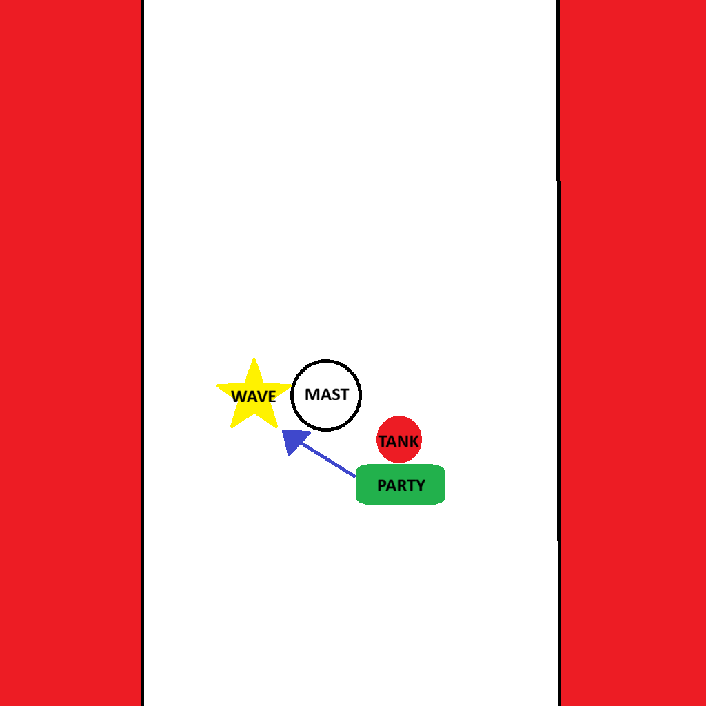

# <Dungeon Name>

!!! warning "⚠️ This Dungeon Guide is Under Construction"
    This page is currently being worked on and may contain incomplete or placeholder information.  
    Check back later for the finalized strategies and role-specific notes.

**Dungeon Timer:**  
**PUG Route:** [Open Route in Method.gg](<PUG_URL>)  
**Advanced Route:** [Open Route in Method.gg](<ADV_URL>)

---

## 🧹 Trash Mobs (Adept)

??? note "Tanks (click to expand)"{.role-tank}
    - **Enemy Name** — Tank-specific mechanic or positioning note.  
    - **Example:** Slave Totems — Reduce mainstat aura; tank away from them.  
    - Use active mitigation on heavy channels (e.g., *Mince*).

??? note "Healers (click to expand)"{.role-healer}
    - **Enemy Name** — Healing-intensive mechanic; expected damage pattern.  
    - **Example:** Gorestained Butcher — *Tantrum*: uninterruptible channel; heal through.  
    - Identify debuffs safe to dispel vs. ones that should be left up.

??? note "DPS (click to expand)"{.role-dps}
    - **Enemy Name** — Interrupt priority list.  
    - **Example:** Horned Seers — *Sanguine Offering* → must interrupt.  
    - Focus order or burst targets if relevant.

??? note "Everyone (click to expand)"{.role-every}
    - **Enemy Name** — Shared mechanics and environmental hazards.  
    - **Example:** Desecraters — Random AoE and soak circles; watch your feet.  
    - Environmental warnings (e.g., “Do not walk on flowers — they spawn adds”).

---

## 🧑‍💼 Boss: Sinthara

??? note "Tanks (click to expand)"{.role-tank}
    - Position boss on east side of mast (east as you enter / the side she is on - see image below)  
    - Try to angle it so you are slightly South and East of her (see image below)

??? note "Healers (click to expand)"{.role-healer}
    - **Deafening Screech** — Raid-wide damage.  Be prepared for group heal.  
    - **Undertow** — Magic DOT cast on 2 players (tank excluded).  Be prepared to dispel after player moves out of party.  
    - There is a constant ticking raidwide so be prepared to heal everyone!  
    

??? note "DPS (click to expand)"{.role-dps}
    - **No DPS Specific Mechanics (See Everyone Section Below)**

??? note "Everyone (click to expand)"{.role-every}
    - Core fight mechanics that affect all roles. 
    - **CORE MECHANIC** In the middle of arena is an interactable mast.  This must be clicked when Siren's Song (Happens at 50%) goes off to chain yourself to it. If you don't you die. 
    - **CORE MECHANIC (Adept)** In the middle of arena is an interactable mast.  This must be used to Line of Sight the Necrotic Wave (big green line AOE) when you are targeted or you get yeeted out of arena.
    - All players **NEED TO BE IN MELEE RANGE** to aid with dodging mechanics. (Namely Siren's Song - see above - and Necrotic Wave - see below)
    - **Deafening Screech** — Interrupts anyone casting when it goes off.
    - **Undertow** — Magic DOT cast on 2 players (tank excluded).  Drops a puddle that damages / slows.  Move to edge of platform to prevent mucking up playable area.
    - **Binding Strike** — Tethers random party member to tank. Stay cloes to prevent damage (if you are standing where you should this should auto-resolve)
    - Be ready to take a step backward when necrotic wave targets another player so you dont get yeeted.

  

---

## 📺 Video Guide

???+ info "Watch Video Guide (click to expand)"
    

      <iframe 
        src="https://www.youtube.com/embed/hz5cAuCR9cI" 
        style="position:absolute;top:0;left:0;width:100%;height:100%;" 
        frameborder="0" allowfullscreen>
      </iframe>
    

---

*Last updated: YYYY-MM-DD*
