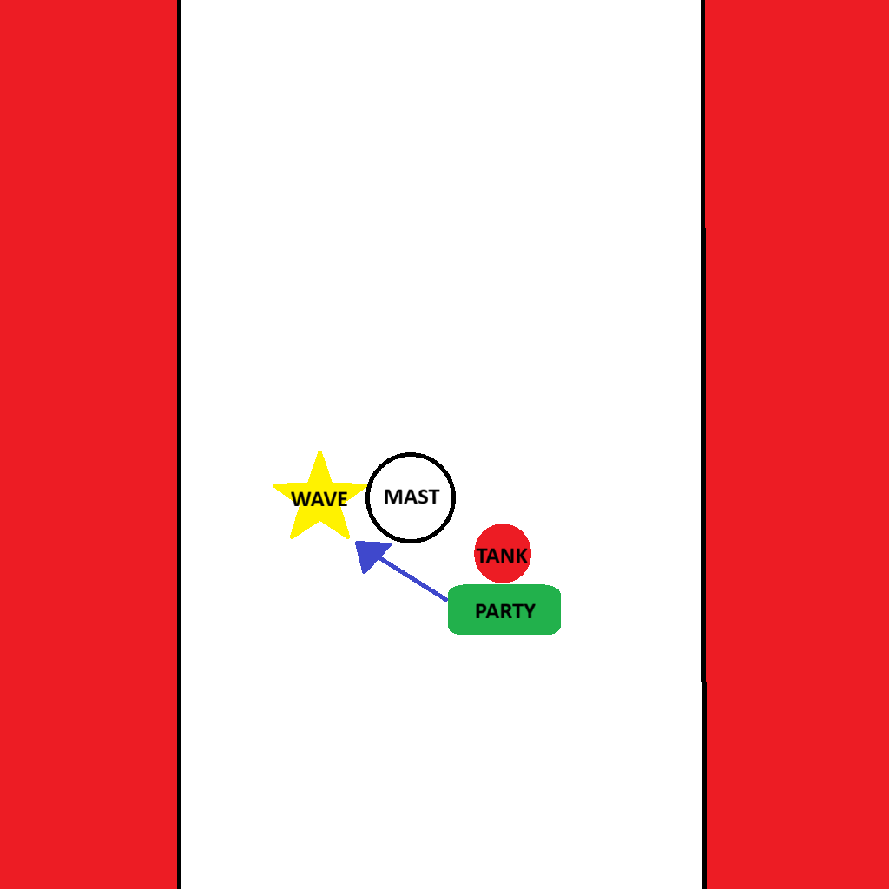

# Sailor's Abyss

**Dungeon Timer: 12:00**  
**PUG Route:** [Open Route in Method.gg](https://www.method.gg/fellowship/route-planner/sailors-abyss#eJx9lM1ugzAQhN/FZyphB5uQY36aQ2+1qh6iCKHgJlYpIAORqqrvXpQ0kGS8uc7Y68+zXv+wms02G7Z8TRdd0dqm1Xb3WZh0kYZPIQt8hqKMhDIiypAnQ6/T96w1blWYL1O2WfFoi6CMybR3toH3LoKT5SISgQxA0A5JF1PGA2pOnsPJ+3CSgJN941PSSR7QkVcSknTODM8v6ar4SNdd5vKR+V6dkJ2hnUuad7VC7wFecXgPq92hsuVe19bZdnj2HoPOgXbIxMVV4sus3BtXdc3cde3NHIETk4mI/3pv83RRuboZRiW4lRKQohAljpJAaYJShJJCCbnkAKGrIrfGjT260QRKSCGRVSKYVJ7IZIzrPLSYosIUFaaokEwhv0JYJVHCYBXSK6RXSB8jfczHqLtC185k+bkt2AJPo+QY7t1+Tws9JacoJdclh62+hzN8mzBAl4+jH6F51TTaOlOeADjbbgOWsxnTB1uvXXY03/1X0Zc5shn//QPQ8UZa)  
**Advanced Route:** [Open Route in Method.gg](https://www.method.gg/fellowship/route-planner/sailors-abyss#eJx1lEtvwjAQhP+Lz1SK81gDRx7l0FujqgeEooi4YNUlkUmQqqr/vYFSHp3d6zfxenZ2nS/VqPFyqWbPxbTzrdu3uVu/e1tMi+ghUgNOIEkYnYR8UbyWrQ1zbz/sri19r6TSkVgSkqGkiLWyk/D4VMz9W7HoylD1UEcs1aLVo7IasIkY6WbRqxaz0vKZEes4Zmki9iErw3OH/2rxQbEw/as9X29rt9vkjQuuvawGI4jRaVGJM1Gh64xm5W5jQ93tJ6Fr79YDFCMmEp/rvUyKaR2a/c0C3qERoDRCpBHFiBJEKSJChL6yi4m89pWz4TqjOxYjShARIoNXMogxhoERBkYYGGFghIERBkYZIsyQ0D2he0L3Bt0bfc2r83kTbFn9TgDjwK4ybCG72W54LYn4jlL2pfL/RGIphmLQsMExGOzB4BgMjsEwNw6FNI/XrlYDVamxyreuWYTyYD975/3XBzXW3z+Lbhrk)

---

## 🧹 Trash Mobs (Adept)

??? note "Tanks (click to expand)"
    - **Hollowed Corsair (Adept)** — CC Immune enemy that has Wailing Strike making all autos cleave (frontal) and add bleed stacks. Point Away from group and kite to drop bleed stacks.
    - **Fading Raiders** — Gains 2% Haste buff on auto (Max 40%).  These can be scary in large groups as they ramp.  Have care and save CDs for late pull.

??? note "Healers (click to expand)"
    - **There are a ton of dispels in this dungeon** - Watch your frames!! 
    - **Tormented Specters** — Casts Anguish Unleashed (Raidwide Damage). Be ready to group heal if DPS miss interrupts.

??? note "DPS (click to expand)"
    - **Water Elementals** — Interrupt Healing Waters (no CC only hard interrupt)
    - **Vengful Shade** — Casts Curse of Drowning (Magic DOT + Slow).  This can be interrupted with CC (Save hard ints for other casts).
    - **Tormented Specters** — Usually spawns with Vengful Shades (see above).  Casts Anguish Unleashed (Raidwide Damage).  Interrupt when possible.
    - **Deepbound Magi** — Must interrupt Shadow Eruption (Potential Lethal Raidwide)
    
??? note "Everyone (click to expand)"
    - **Water Elementals** — All players in melee to mitigate second cast damage.
    - **Witchreef Lashers (Adept)** — Casts Witchreef Toxin (uninterruptable) DOT debuff (weak but can stack).  Mass dispel relic is super useful here.
    - **Vengful Shade and Tormented Specters (Adept)** — Gains Bitter Frenzy (Haste Buff) makes interrupts harder and increases damage throughput. 
    - **Deepbound Magi (Adept)** — Casts Harrowing Solitude (AOE Split Damage).  Everyone in melee on these pulls to split damage (alone = Lethal).
    
---

## 🧑‍💼 Boss: Sinthara

??? note "Tanks (click to expand)"
    - Position boss on east side of mast (east as you enter / the side she is on - see image below)  
    - Try to angle it so you are slightly South and East of her (see image below)

??? note "Healers (click to expand)"
    - **Deafening Screech** — Raid-wide damage.  Be prepared for group heal.  
    - **Undertow** — Magic DOT cast on 2 players (tank excluded).  Be prepared to dispel after player moves out of party.  
    - There is a constant ticking raidwide so be prepared to heal everyone!  
    

??? note "DPS (click to expand)"
    - **No DPS Specific Mechanics (See Everyone Section Below)**

??? note "Everyone (click to expand)"
    - Core fight mechanics that affect all roles. 
    - **CORE MECHANIC - Siren's Song** In the middle of arena is an interactable mast.  This must be clicked when Siren's Song (Happens at 50%) goes off to chain yourself to it. If you don't you die. 
    - **CORE MECHANIC - Necrotic Wave (Adept)** In the middle of arena is an interactable mast.  This must be used to Line of Sight the Necrotic Wave (big green line AOE) when you are targeted or you get yeeted out of arena (see image below).
    - All players **NEED TO BE IN MELEE RANGE** to aid with dodging mechanics. (Namely Siren's Song - see above - and Necrotic Wave - see below)
    - **Deafening Screech** — Interrupts anyone casting when it goes off.
    - **Undertow** — Magic DOT cast on 2 players (tank excluded).  Drops a puddle that damages / slows.  Move to edge of platform to prevent mucking up playable area.
    - **Binding Strike** — Tethers random party member to tank. Stay cloes to prevent damage (if you are standing where you should this should auto-resolve)
    - Be ready to take a step backward when necrotic wave targets another player so you dont get yeeted.

###ARENA MAP FOR POSITIONING

  

---

## 📺 Video Guide

???+ info "Watch Video Guide (click to expand)"
    

      <iframe 
        src="https://www.youtube.com/embed/hz5cAuCR9cI" 
        style="position:absolute;top:0;left:0;width:100%;height:100%;" 
        frameborder="0" allowfullscreen>
      </iframe>
    

---

*Last updated: 2025-10-25*
