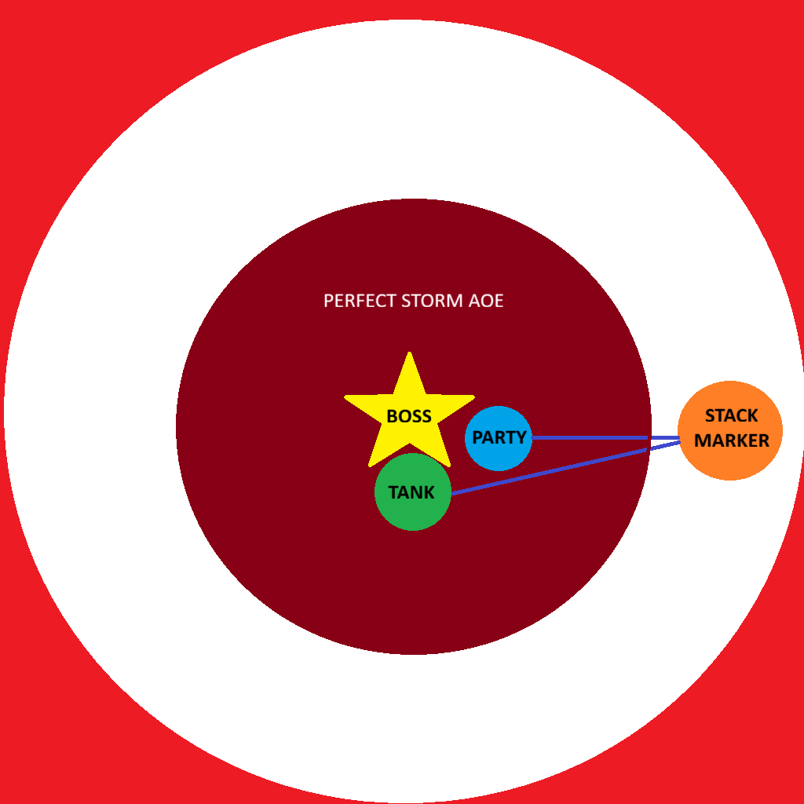

# Stormwatch
**Dungeon Timer: 15:00**
**PUG Route:** [Open Route in Method.gg](https://www.method.gg/fellowship/route-planner/stormwatch#eJyFVV1vgjAU/S99dguUL/Vt4Bb3MGNm5osxpGInzSolbTFZlv33IWMgrre+nsO9Pef23PKFSjTdbNBimc4Jf38hRUZ0llOZJql756CRkfEaZr1OnzO6Y5ouGefk0FDBHxVzkn0cmdJJpXUuBdFdS2Oh31Cz13RGihoRlYplpWlbtB1tzlxScX1uSZRuihxQogOf5IFFPsiEVlu4VWiqHIM9J6BjbD0tsrJj2HgEU5PWwVuSPp4YX5VMMt2N8Rp1jSg2op4R9Y1oYERDIxq1isGodUNcCaGVJqyg+wepRFF/eBlFM32j2odH6VpC7mI4yxEYlL6j2Wlo1xqBOXP6GRq0TmAf2LJe2OIfYwtneVWwZd446LcvFkrNKecZ4fx3o/+YVc6KLBdlOXw3hrBnhn0zHJjhG7fh2GnvwkzF+WdMVG7VhgEc+h4w4wNu/BDAu7gOZQaQftc1N4JwDAjCYX/CVacJUAHcNu5P1kIeVSYpOfaa2jX9tzSd8SeS0foCd7vh33IIYwjHAO7Z0nwfoO12hPZoihbskOsl0VLwus8JTd3vH1k+kS4=)  
**Advanced Route:** [Open Route in Method.gg](https://www.method.gg/fellowship/route-planner/stormwatch#eJyFVEFuwjAQ/EvOVIqdkAC3JrSihyJUVC4IRSa4xKqJke0gVVX/3hAgELrrXmfizc7s7nx7e2+0XHrTWTZh8uOVlTmzecF1lmbkwfd6IBM0zGKRveR8LSyfCSnZtqH6FyqRLP/cCWPTytpCK2bbkuDDsKHGb1laSXt8xoxtCB9tw8erBeijAcoMa2bVW8IFY/xfQ5wiDsGEuq1q6blS1lgmSr551EaV9Ye3VsI0PYt5T7Ong5DzvdDCtp7dowREKYgGIBqCaB9EIxCNzx3XKzBmZe2RqkyiK8vbroHliNFpXq2H7Y3c/sWuZSCOkVPHVlLHOlDq4BwHR0MH17/YkyhjJlzKnEl5OrdG3ZGppPxKmCluzreG54Uo80Lt990b7MIBDIcwjNT+ZxC+mw7Oc/qjBOuNIjj2PSImRNSEEYLH10afWc5rJev1aZnaRLrDh20lq/TO5JqzXTeY74lWW9cKQuCeMJwi2miEhApBUgWOFQLnCoGDhcDJQuBoIXC2DED0EvhQ4sTIUGCYYjhFcGTbbmbedR45QIquQuP9atXzNt7Im4ptYWfMaiXrrw/eiPz8Aj9emcs=)

---

## 🧹 Trash Mobs (Adept)

??? note "Tanks (click to expand)"
    - **Pillagers** - Gain stack of Blood Frenzy (haste / damage / health) on each mob death in pull. Be ready to pop CDs at end of pull if they are empowered.
    - **Nightmist Cutthhroat** - Teleports behind you (Stopping your ability to cast).  When a mob hits you from behind they do more damage.  Pay attention and reposotion as they TP.
    - **Executioner (Adept)** - Frontal Cleave with stacking 5% increase damage taken debuff.  This has to be tanked facing away from the group, and you will need defensive CDs near end of pull (or kites to drop stacks).
    - **Ashen Arsonist** - These mobs cast frontal cleave at tank.  Esure they are facing away from partry, and you can avoid this if your quick.
    - **Bully Basher** - Has mini-tankbuster (Bully Bash).  Make sure active mitigation is rolling.
    - **Bully Basher (Adept)** - These mobs cast Together Stronger.  This must be interrupted as it grants 20% DR to all mobs.

??? note "Healers (click to expand)"
    - **Pillagers** - Gain stacks of Blood Frenzy on each mob death in pull. Be ready with big heals if they are alive near end of big pull.
    - **Profane Seeker (Adept)** - These mobs cast Wither on random party member. If cast goes off be ready with a dispel.
    - **Ashen Arsonist (Adept)** - These mobs cast Big Ooga Flame on random party member.  Be ready with dispels.
    - Add healer notes (e.g., heavy damage windows, dispels, or priority heals).

??? note "DPS (click to expand)"
    - **Mancatchers** - These mobs cast grip on ranged.  Stack with Melee on packs with Mancatchers to negate.
    - **Pillagers** - Gain stack of Blood Frenzy (haste / damage / health) on each mob death in pull.  This makes them tankier than most mobs but need to die first or risk bursting the tank for a wipe.
    - **Profane Seeker (Adept)** - These mobs cast Wither on random party member.  This needs to be interrupted.
    - **Ashen Arsonist (Adept)** - These mobs cast Big Ooga Flame on random party member.  This should be interrupted as much as possible.
    - **Bully Basher (Adept)** - These mobs cast Together Stronger.  This must be interrupted as it grants 20% DR to all mobs.
    
??? note "Everyone (click to expand)"
    - **Dire Rats** - These mobs drop aggro at 50% health and fixate on a random player.  They also heal for damage done.  Kite and burn.  
    - **Facestabber** - These mobs jump to a random player and cast "Stab Yer Face", a heavy damamge channel.  Be ready with CC.
    - **Stormscreamer** - These mobs cast ball lighting at random player doing heavy damage to anyone hit by it.  If you can dodge a wrench, you can dodge a ball lighting.

---

## 🧑‍💼 Boss: Warlord Brogg

??? note "Tanks (click to expand)"
    - **Dread Arc** - This should be interrupted every cast. Heavy party Damage
    - **Forked Lightning** - Frontal Cone Tankbuster.  Use active mitigation or CD and point away from party.
    - **Raiders** - Summons 2 adds that need to be picked up. 

??? note "Healers (click to expand)"
    - **Lightning Rod (Adept)** - Group Soak.  Lasts 12 Seconds giving heavy damage every second.  Pop big CDs here.

??? note "DPS (click to expand)"
    - **Dread Arc** - This should be interrupted every cast. Heavy party Damage
    - **Raiders** - Summons 2 adds that need to be deleted ASAP.  If they are up when "Perfect Storm" goes off they will grip you into it unless perfect executions (see below - Everyone)

??? note "Everyone (click to expand)"
    - **EZMODE** Tank places two markers.  One slightly east of where they will tank, and one to the far east of that mark (basically out of where perect storm cast). 
        - The party stacks on melee stack marker, and moves together to far marker to allow all mechnics to resolve with minimal damage (see image below)
    - **Lightning Rod (Adept)** - Group Soak.  Collapse to Melee.
    - **Perfect Storm** - Everyone needs to get out of AOE. This will be made difficult by overlapping mechanics.  
    - Add universal mechanics (soaks, spreads, wipes, etc.).

###ARENA MAP FOR POSITIONING

  

---

## 📺 Video Guide

???+ info "Watch Video Guide (click to expand)"
    

      <iframe 
        src="https://www.youtube.com/embed/INNMLUM7O8w" 
        style="position:absolute;top:0;left:0;width:100%;height:100%;" 
        frameborder="0" allowfullscreen>
      </iframe>
    

---

*Last updated: 2025-10-26*
